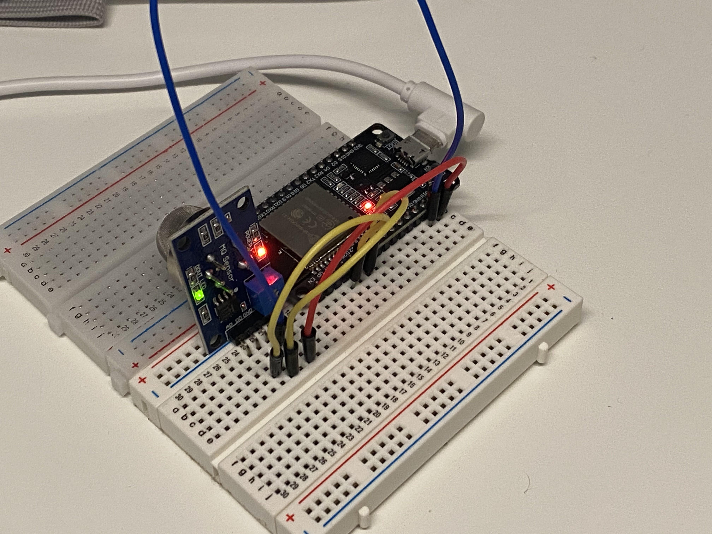

# Fire_Alarm
Fire_Alarm with ESP32 and LINE Notify

## Usage

Prepare ESP32 and MQ-2 module.



### Pin assignment

ESP32         MQ-2
GND      =>   GND
GPIO32   =>   D0
GPIO34   =>   A0
VIN(5V)  =>   VCC

### Install

Download esp32-20180511-v1.9.4.bin

```sh
pip install esptool
esptool.py --port /dev/ttyUSB0 erase_flash #MAC/Linux
esptool.py --port COM# erase_flash #Windows
esptool.py --chip esp32 --port /dev/ttyUSB0 write_flash -z 0x1000 esp32-20180511-v1.9.4.bin
esptool.py --chip esp32 --port COM# write_flash -z 0x1000 esp32-20180511-v1.9.4.bin
```

If you receive the message "A fatal error has occurred. The MD5 of the file does not match the data in the flash!" is displayed.

```sh
sudo python /home/johnz/.local/lib/python3.8/site-packages/esptool.py --chip auto --port /dev/ttyUSB0 --baud 115200 --before default_reset --no-stub --after hard_reset write_flash -u --flash_mode dio --flash_freq 40m --flash_size 4MB 0x0 factory/factory_WROOM-32.bin #MAC/Linux

sudo python /home/johnz/.local/lib/python3.8/site-packages/esptool.py --chip auto --port COM# --baud 115200 --before default_reset --no-stub --after hard_reset write_flash -u --flash_mode dio --flash_freq 40m --flash_size 4MB 0x0 factory/factory_WROOM-32.bin #Windows
```

#### Rewrite programs

boot.py
```python
sta_if.connect('{Rewrite}', '{Rewrite}')
```

main.py
```python
TOKEN = '{Rewrite}'
```

When all work is complete, run it through Thony.

```sh
%Run -c $EDITOR_CONTENT
```
